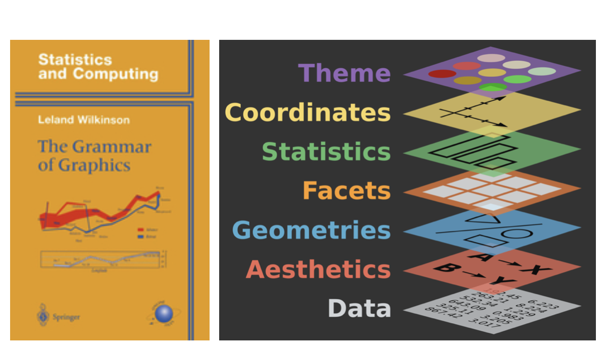

```{r setup, echo=FALSE}
knitr::opts_chunk$set(
  message = FALSE,
  warning = FALSE,
  collapse = TRUE
)
```


---

## Visão rápida

- O `ggplot2` foi criado por Hadley Wickham, baseado no livro *Grammar of Graphics*, de Leland Wilkinson.
- A ideia é pensar em um "gráfico" como uma estrutura racional, composta por **camadas**.

```{r camadas, echo=FALSE}

```

- Não precisa ter todas as camadas, mas três são **obrigatórias**:
  + **data**: o conjunto de dados deve ser uma `tibble` (ou, pelo menos, um `dataframe`);
  + **aesthetics**: mapeamentos estéticos, como selecionamento das variáveis em questão;
  + **geometries**: são as formas do gráfico (pontos, boxplot, histograma, etc)

- Não veremos todos os gráficos, apenas alguns poucos;
- Apenas tangenciaremos o pacote !!

## Queira comunicar, não "lacrar"!


## Antes de começar

- Vamos carregar a biblioteca do `tidyverse`, não apenas a do `ggplot`.
- Isso se deve ao fato de sempre precisarmos manipular os dados antes de plotar algum gráfico.

O código abaixo carrega o pacote:

```{r tidyverse}
library(tidyverse)
```

- Depois disso, usaremos a função `read_csv()` para acessar o conjunto de dados.
- Usaremos o conjunto de dados `milhas_por_galao.csv`, bem como o conjunto de dados `notas_disciplinas.csv`, ambos disponíveis em nosso repositório: [Dados.csv](https://github.com/icaro-freire/dados_csv).
  + O primeiro conjunto de dados, nomearemos por `dados_mpg` e o segundo por `dados_notas`

```{r lendo-dados}
# Lendo o conjunto `milhas_por_galao.csv`
dados_mpg <- read_csv("dados/milhas_por_galao.csv")

# Lendo o conjunto de dados `notas_disciplina.csv`
dados_notas <- read_csv("dados/notas_disciplina.csv")
```

- O *dataset* `dados_mpg` ficaria assim:

```{r}
dados_mpg
```

- Já o *dataset* `dados_notas`, assim:
  + veja que esse conjunto de dados não está na forma `tidy`. 
  
```{r}
dados_notas
```

## Sintax do ggplot

```{r, eval=FALSE}
ggplot(dados, mapping = aes(x = ..., y = ..., outras = ...)) +
  geom_funcao(opções)
```

Ou, usando o *pipe*:

```{r, eval=FALSE}
dados %>% 
  ggplot(mapping = aes(x = ..., y = ..., outras = ...)) +
  geom_funcao(opções)
```

- Note que usamos o sinal "`+`" para *adicionar* as camadas do `ggplot`.
- Para ficar mais explícito, às vezes usaremos assim:

```{r, eval=FALSE}
dados %>% 
  ggplot() +
  aes(x = ..., y = ..., outras = ...) +
  geom_funcao(opções)
```

## 1. Gráficos de Pontos

- Também são chamados de "gráfico de dispersão" (*scatter plot*)
- Relaciona variáveis numéricas.
- Vamos relacionar a quantidade de cilindradas com a quantidade de milhas por galão em rodovia.
  + ou seja, vamos relacionar as seguintes variáveis numéricas em nosso *dataset*: `rodovia` e `cilindrada`.
  + estamos usando o *dataset* `dados_mpg`.
- Nesse exemplo, vamos usar as camadas, passo a passo (mesmo não precisando)

### 1º Camada: *Data* (dados)

```{r}
ggplot(data = dados_mpg)
```

- Observe que se colocarmos apenas a camada dos "dados", não aparece (quase) nada
  + carrega-se apenas o conjunto de dados

### 2º Camada: *Aesthetics* (estética)

- Acrescentando a camada estética geral (`aes()`), já aparecem os valores do eixo $x$ e os valores do eixo $y$.
  + também é costume colocar essa camada dentro da camada `ggplot()`, assim: `ggplot(data = ..., aes(x = ..., y = ...))`.
  
```{r}
ggplot(data = dados_mpg) +
  aes(x = rodovia, y = cilindrada)
```
### 3º Camada: *Geometries* (geometria)

- Vamos agora acrescentar a camada da geometria dos dados

```{r}
ggplot(data = dados_mpg) +
  aes(x = cilindrada, y = rodovia) +
  geom_point()
```
- Veja com com essas três camadas, já temos um conjunto de informações básicas sobre o que desejamos comunicar.
  + as outras camadas, deixam o gráfico mais "bonito".
- Também podemos acrescentar argumentos convenientes na camada `Geometries`, como `size` (que altera o tamanho dos pontos)
- Apenas por simplicidade, vamos omitir o nome "date"

```{r}
ggplot(dados_mpg) +
  aes(x = cilindrada, y = rodovia) +
  geom_point(size = 2)
```

### 4º Camada: *Facets* (facetas)

- Ao acrescentar a camada "facets", particularizamos alguma característica desejável
  + no exemplo, estamos facetando pelo ano, ou seja, separando os dados por ano.
  + usaremos a função `facet_grid()`

```{r}
ggplot(data = dados_mpg) +
  aes(x = cilindrada, y = rodovia) +
  geom_point(size = 2) +
  facet_grid(ano~.)
```
- Veja que  usamos o argumento `ano~.`
  + isso faz com que a variável `ano` fique na "horizontal"
  + Se mudarmos a posição desse argumento, ou seja, `.~ano`, fica assim:

```{r}
ggplot(data = dados_mpg) +
  aes(x = cilindrada, y = rodovia) +
  geom_point(size = 2) +
  facet_grid(.~ano)
```
- Ainda podemos mudar a cor dos pontos, de acordo com a classe dos carros.
  + para isso usaremos o argumento `color = classe`
  + devemos acrescentar o argumento `color` dentro de um `aes()` (local), pois relaciona à mudanças na **variável** do dataset (ou seja, ele mapeará as características estéticas em cada parte da variável);
  + se a mudança é apenas numérica, não precisa do `aes()`
  
```{r}
ggplot(data = dados_mpg) +
  aes(x = cilindrada, y = rodovia) +
  geom_point(size = 2, aes(color = classe)) +
  facet_grid(.~ano)
```
- Se não tivéssemos acrescentado o `aes()` ficaria assim (com erro):

```{r, eval=FALSE}
ggplot(data = dados_mpg) +
  aes(x = cilindrada, y = rodovia) +
  geom_point(size = 2, color = classe) +
  facet_grid(.~ano)
```

### 5º Camada: *Statistics* (estatísticas)

- Pode ser a média, mediana, uma regra de regressão, etc.
- para esse exemplo, usaremos uma curva que melhor se ajusta nos conjuntos de pontos.
  + para isso, usaremos a função `geom_smooth()`
  
```{r}
ggplot(data = dados_mpg) +
  aes(x = cilindrada, y = rodovia) +
  geom_point(size = 2, aes(color = classe)) +
  facet_grid(.~ano) +
  geom_smooth()
```

- Se quisermos uma reta que melhor se adeque aos pontos, devemos acrescentar o argumento ``method = lm`:

```{r}
ggplot(data = dados_mpg) +
  aes(x = cilindrada, y = rodovia) +
  geom_point(size = 2, aes(color = classe)) +
  facet_grid(.~ano) +
  geom_smooth(method = lm)
```

- Caso seja conveniente retirarmos o "sombreamento" (intervalo de confiança) da curva (inclusive a reta), usamos o argumento `se = FALSE`.

```{r}
ggplot(data = dados_mpg) +
  aes(x = cilindrada, y = rodovia) +
  geom_point(size = 2, aes(color = classe)) +
  facet_grid(.~ano) +
  geom_smooth(method = lm, se = FALSE)
```

- E, se quisermos mudar a cor dessa reta de regressão, podemos fazer dentro dessa camada:

```{r}
ggplot(data = dados_mpg) +
  aes(x = cilindrada, y = rodovia) +
  geom_point(size = 2, aes(color = classe)) +
  facet_grid(.~ano) +
  geom_smooth(method = lm, se = FALSE, color = "red")
```

### 6º Camada: *Coordinates* (coordenadas)

- Podemos usar coordenadas cartesianas ou polares;
  + no nosso exemplo, estamos usando coordenadas polares.
- Também é possível delimitar os eixos coordenados.
  + em nosso caso, usaremos as funções `xlim` e `ylim` dentro da função `coord_cartesian()`

```{r}
ggplot(data = dados_mpg) +
  aes(x = cilindrada, y = rodovia) +
  geom_point(size = 2, aes(color = classe)) +
  facet_grid(.~ano) +
  geom_smooth(method = lm, se = FALSE, color = "red") +
  coord_cartesian(xlim = c(0, 8), ylim = c(10, 45))
```

### 7º Camada: *Theme*

- Podemos colocar um tema que melhor se adeque ao aspecto de nosso texto
  + no nosso caso, vamos usar o tema `theme_bw`
```{r}
ggplot(data = dados_mpg) +
  aes(x = cilindrada, y = rodovia) +
  geom_point(size = 2, aes(color = classe)) +
  facet_grid(.~ano) +
  geom_smooth(method = lm, se = FALSE, color = "red") +
  theme_bw()
```

- Também podemos modificar o título e os nomes dos eixos com a função `labs()`

```{r}
ggplot(data = dados_mpg) +
  aes(x = cilindrada, y = rodovia) +
  geom_point(size = 2, aes(color = classe)) +
  facet_grid(.~ano) +
  geom_smooth(method = lm, se = FALSE, color = "red") +
  theme_bw() +
  labs(
    title = "Correlação entre variáveis numéricas",
    subtitle = "Cilindrada vs Milhas por Galão",
    x = "Cilindrada",
    y = "Milhas por Galão de Combustível"
  )
```

## 2. Gráficos de linha

- Usaremos para esse gráfico o *dataset* `notas_disciplina.csv`.
- Precisamos deixá-lo na forma `tidy``, pivotando as colunas (já vimos como faz isso)
  + também renomearemos uma das variáveis
  + chamaremos esses dados modificados por `notas_tidy`

```{r}
notas_tidy <- dados_notas %>% 
  pivot_longer(
    !Curso,
    names_to = "ano",
    values_to = "notas"
  ) %>% 
  rename(curso = Curso)

notas_tidy
```

- Para criarmos o gráfico de linhas, vamos usar as médias do conjunto de dados ao longo dos anos.
- Agora, vamos sumarizar as médias das turmas por ano:
  + chamaremos de `p`

```{r}
p <- notas_tidy %>% 
  group_by(ano) %>% 
  summarise(
    media_notas = round(mean(notas), 1)
)

p
```

```{r}
 p %>% 
  ggplot(aes(x = ano, y = media_notas, group = 1)) +
  geom_line(color = "#BF616A", size = 1)
```
- Note que:
  + usamos o comando `group = 1` no `aes()` geral.
  + escolhemos uma cor vermelha específica (com suporte em html)
- O código completo, já com o tema, fica

```{r}
 notas_tidy %>% 
  group_by(ano) %>% 
  summarise(
    media_notas = round(mean(notas), 1)
  ) %>% 
  ggplot(aes(x = ano, y = media_notas, group = 1)) +
  geom_line(color = "#BF616A", size = 1) +
  labs(
    title = "Gráfico de Linhas das Notas",
    x = "",
    y = "Média das Notas"
  ) +
  theme_minimal()
```
- Veja que o "`+`" só é colocado nas **camadas** do ggolot.
  + um erro comum é trocar o `+` pelo ` %>% ` (pipe)

## 3. Gráfico de Colunas

- Para o gráfico de colunas, vamos usar o `dados_mpg` e relacionarmos quantos carros usam os diferentes combustíveis (`p` = *premium*; `r` = *regular*; `e` = *ethanol*; `d` = *diesel*; `g` = *gás*).

```{r}
dados_mpg %>% 
  count(combustivel)
```

- Assim, usaremos a função `geom_col()` para criarmos o gráfico de colunas, relacionando o combustível com sua frequência absoluta `n`

```{r}
dados_mpg %>% 
  count(combustivel) %>%
  ggplot(aes(x = combustivel, y = n)) +
  geom_col()
```
- Se quisermos preencher cada coluna com uma cor de acordo com o tipo de combustível, devemos acrescentar no `aes()` um argumento para tal fato.
  + o argumento `color` vai cobrir a fronteira dos gráficos;
  + o argumento `fill` vai preencher o interior dos gráficos.

```{r}
dados_mpg %>% 
  count(combustivel) %>%
  ggplot(aes(x = combustivel, y = n , color = combustivel)) +
  geom_col()
```

```{r}
dados_mpg %>% 
  count(combustivel) %>%
  ggplot(aes(x = combustivel, y = n , fill = combustivel)) +
  geom_col()
```
- Há um conjunto de cores ([viridis](https://cran.r-project.org/web/packages/viridis/vignettes/intro-to-viridis.html)) que ajuda na visualização de pessoas com dificuldade de visão ou daltonismo
  + particularmente, uso a variação `d` (*default*)

```{r}
dados_mpg %>% 
  count(combustivel) %>%
  ggplot(aes(x = combustivel, y = n , fill = combustivel)) +
  geom_col() +
  scale_fill_viridis_d()
```
- Uma maneira rápida de reordenarmos as colunas de forma crescente é usarmos a função `fct_reorder()`, do pacote [`forcats`](https://forcats.tidyverse.org/) (incluso no `tidyverse`).

```{r}
dados_mpg %>% 
  count(combustivel) %>% 
  ggplot(aes(x = fct_reorder(combustivel, n), y = n, fill = combustivel)) +
  geom_col() +
  scale_fill_viridis_d()
```
- Para a ordenação de forma decrescente, podemos usar a função `desc()`, ou simplesmente colocar o sinal "`-`" antes da variável numérica que estamos ordenando.

```{r}
dados_mpg %>% 
  count(combustivel) %>% 
  ggplot(aes(x = fct_reorder(combustivel, -n), y = n, fill = combustivel)) +
  geom_col() +
  scale_fill_viridis_d()
```
- Melhorando o gráfico, temos:

```{r}
dados_mpg %>% 
  count(combustivel) %>% 
  ggplot(aes(x = fct_reorder(combustivel, -n), y = n, fill = combustivel)) +
  geom_col() +
  scale_fill_viridis_d() +
  labs(
    title = "Comparando os tipos de combustíveis",
    subtitle = "(`p` = premium; `r` = regular; `e` = ethanol; `d` = diesel; `g` = gás)",
    x = "",
    y = ""
)
```


### 3.1 Gráfico de Barras

- Mesma ideia do anterior
- Geralmente usado quando o nome da variável é grande
- o pacote `scales` será usado para exibir um dos eixos com notação de porcentagem.
  + esse pacote faz muitas outras coisas, mas só usaremos essa nesse exemplo.
  + se você não tiver instalado, faça-o com o comando `install.packages("scales")`.

```{r}
library(scales)
```

- Usamos a função `label_percent()`, dentro da função `scale_x_continuous()`, no argumnento `label`.
  + também podemos delimitar o eixo $x$ por aqui!
  + o termo `accuracy` diz quantas casas decimais desejamos, caso seja necessário.

```{r}
dados_mpg %>% 
  count(classe) %>% 
  mutate(prop = n / sum(n)) %>% 
  ggplot() +
  aes(x = prop, y = fct_reorder(classe, prop), fill = classe) +
  geom_col() +
  scale_fill_viridis_d() +
  scale_x_continuous(
    labels = label_percent(accuracy = 1), 
    limits = c(0, .3)
  ) +
  labs(
    title = "Porcentagem das Classes dos Carros",
    x = "",
    y = ""
  ) +
  theme_minimal()
```

## 4. Histograma

- Um histograma é uma representação gráfica da distribuição de uma variável numérica. 
  + note que aceita apenas variáveis numéricas de entrada. 
- A variável é dividida em várias classes (intervalor)
  + o número de observações por classes é representado pela altura da barra.
- Usaremos o *dataset* `notas_tidy` para exemplificação:

```{r}
notas_tidy %>% 
  ggplot() +
  aes(x = notas) +
  geom_histogram(fill = "blue", color = "black") +
  labs(
    title = "Histograma das Notas",
    x = "Notas",
    y = ""
  ) +
  theme_minimal()
```

- Podemos alterar o tamanho das classes usando o argumento `binwidth`

```{r}
notas_tidy %>% 
  ggplot() +
  aes(x = notas) +
  geom_histogram(fill = "blue", color = "black", binwidth = 1) +
  labs(
    title = "Histograma das Notas",
    x = "Notas",
    y = ""
  ) +
  theme_minimal()
```

## 5. Gráfico de Densidade

- Podemos interpretar como uma `suavização` do Histograma.

```{r}
notas_tidy %>% 
  ggplot() +
  aes(x = notas) +
  geom_density(fill = "#404080")
```
- Podemos comparar por curso

```{r}
notas_tidy %>% 
  ggplot() +
  aes(x = notas) +
  geom_density(aes(fill = curso), alpha = 0.3) +
  scale_fill_viridis_d()
```
- Ainda separando por "facetas" pelos cursos

```{r}
notas_tidy %>% 
  ggplot() +
  aes(x = notas) +
  geom_density(aes(fill = curso), alpha = 0.3) +
  facet_grid(curso~.) +
  scale_fill_viridis_d()
```
- Ou "facetando" ao longo dos anos

```{r}
notas_tidy %>% 
  ggplot() +
  aes(x = notas) +
  geom_density(aes(fill = curso), alpha = 0.3) +
  facet_grid(ano~.) +
  scale_fill_viridis_d()
```
- Este último, por conter muita informação, não ficou tão clara nossa comunicação.
  + Para contornar isso, podemos usar o pacote [`ggridges`](https://cran.r-project.org/web/packages/ggridges/vignettes/introduction.html)

### 5.1 Ridgeline (Joyplot)

- Carregue (se preciso, instale-o antes) o pacote `ggridges`

```{r}
# install.packages("ggridges")
library(ggridges)
```

- Usaremos a função `geom_density_ridges()`

```{r}
notas_tidy %>% 
  ggplot() +
  aes(x = notas, y = ano, fill = curso) +
  geom_density_ridges(alpha = 0.5) +
  scale_fill_viridis_d()
```

- Podemos filtrar por um curso específico, por exemplo, Química.

```{r}
notas_tidy %>% 
  filter(curso == "Qui") %>% 
  ggplot() +
  aes(x = notas, y = ano, fill = curso) +
  geom_density_ridges(alpha = 0.5) +
  scale_fill_viridis_d()
```

## 6. Boxplot

- Já vimos muito sobre boxplot em nossa disciplina (inclusive artigos que explicam os pormenores)
- Para exemplificar, continuaremos com o *dataset* `notas_tidy`.
  + inicialmente, vamos comparar, ao logo dos anos, os boxplots dos cursos
  
```{r}
notas_tidy %>% 
  ggplot() +
  aes(x = ano, y= notas, fill = curso) +
  geom_boxplot() +
  scale_fill_viridis_d()
```
- Agora, vamos comparar apenas as notas ao longo dos anos.
  + se quisermos omitir as legendas, usamos `show.legend = FALSE`

```{r}
notas_tidy %>% 
  ggplot() +
  aes(x = ano, y= notas) +
  geom_boxplot(aes(fill = ano), show.legend = FALSE) +
  scale_fill_viridis_d()
```
## Extra: reta vertical e anotações

- Considere a densidade das notas do curso:

```{r}
notas_tidy %>% 
  ggplot() +
  aes(x = notas) +
  geom_density(fill = "lightblue") +
  labs(
    title = "Distribuição das Notas",
    subtitle = "(Tanto de Matemática, quanto de Química)",
    x = "Notas",
    y = "Distribuição"
  ) +
  theme_minimal()
```
- Como representar, por exemplo, a média dessas notas com uma reta vertical?

```{r}
notas_tidy %>% 
  ggplot() +
  aes(x = notas) +
  geom_density(fill = "lightblue", alpha = 0.6) +
  labs(
    title = "Distribuição das Notas",
    subtitle = "(Tanto de Matemática, quanto de Química)",
    x = "Notas",
    y = "Distribuição"
  ) +
  theme_minimal() +
  geom_vline(aes(xintercept = mean(notas)), color = "red") 
```
- E se quisermos colocar o nome "Média" nessa reta?

```{r}
notas_tidy %>% 
  ggplot() +
  aes(x = notas) +
  geom_density(fill = "lightblue", alpha = 0.6) +
  geom_vline(aes(xintercept = mean(notas)), color = "red") +
  labs(
    title = "Distribuição das Notas",
    subtitle = "(Tanto de Matemática, quanto de Química)",
    x = "Notas",
    y = "Distribuição"
  ) +
  theme_minimal() +
  annotate("text", x = 6, y = 0.05, label = "Média", color = "red")
```

